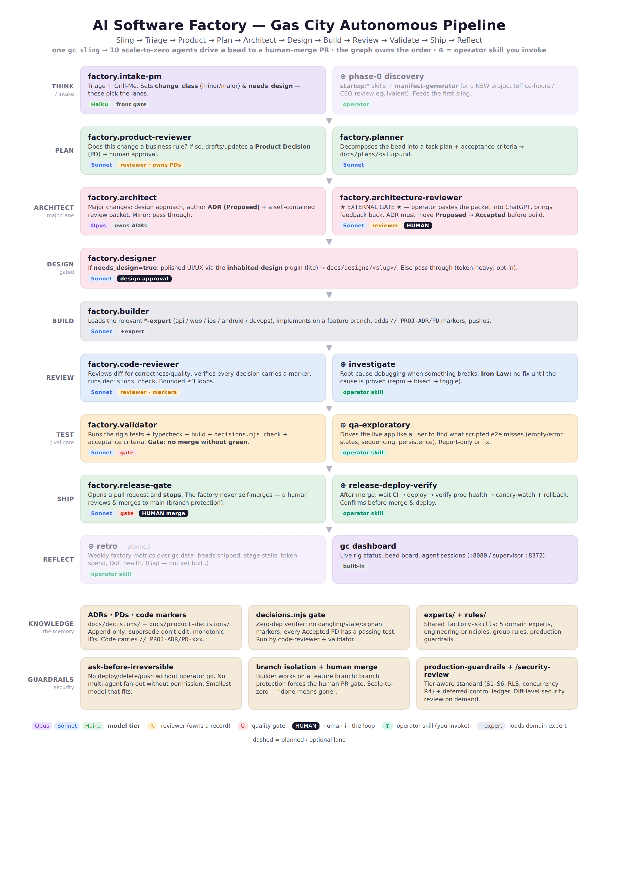

# software-factory

A reusable **agentic software factory**: a multi-agent build pipeline plus the
shared, cross-project assets that keep it honest. One source of truth, installed
into whichever agent/CLI runs the work. Every project (rig) imports from here;
project-specific decisions stay in each project repo.

The pipeline (`packs/core-factory/`) is a [Gas City](https://github.com/) pack of
10 cooperating agents — intake/PM → planner → architect → designer → builder →
product / architecture / code reviewers → validator → release-gate — wired to the
domain experts, engineering rules, and decision-record discipline in this repo.

> Battle-tested, not theoretical: this factory drove a real production web app
> through dozens of shipped increments (architecture decisions, product decisions,
> CI gates, and live deploys). The project-specific examples below have been
> genericized; the discipline they encode is the part that mattered.

**New here?** Read [`START_HERE.md`](START_HERE.md) — a 10-minute orientation map.

## Architecture

<p align="center">
  
</p>

One **city** (the factory) hosts many **rigs** (projects); this pack is imported per-rig
as `factory`. A unit of work — a **bead** — flows one direction through ten role-specialized
agents, and **two lanes** decide how much human oversight it gets:

```
work bead → intake-pm (triage) ─┬─ minor ──────────────────────────────► build → PR ─[human merge]
                                │
                                └─ major → architect (ADR) → external ──► [human accepts] → build → PR
                                                              review                              [human merge]

build = designer (gated) → builder (+expert) → code-reviewer → validator → release-gate
```

- **Minor lane** (bug / small change): runs autonomously to a PR — one human gate, the merge.
- **Major lane** (new subsystem, schema, business rule): the architect writes an **ADR** + a
  review packet; it goes through external review; a human flips the ADR `Proposed → Accepted`
  before any code is built — two human gates.
- Agents are **scale-to-zero**: they materialize when a bead is routed to them, do the work, and
  exit. Idle is the correct resting state.
- The **knowledge discipline** is the load-bearing part: code is the source of truth for derivable
  facts; everything else is an append-only **ADR** (technical why) or **PD** (product why), linked to
  code by `// PROJ-ADR/PD-NNN` markers and enforced by `tools/decisions.mjs check`.

Full wiring, the agent roster, model-tier mapping, and infra mechanics are in
[`docs/FACTORY_WIRING.md`](docs/FACTORY_WIRING.md) (diagram: `docs/factory-wiring-diagram.html`).

## Layout

```
factory-skills/
├── experts/            # cross-project domain experts (on-demand skills)
│   ├── api-expert.md       # backend + API + shared business logic (server-side)
│   ├── web-expert.md       # web/frontend  (V1 client)
│   ├── ios-expert.md       # iOS           (V3/V4)
│   ├── android-expert.md   # Android       (V3/V4)
│   └── devops-expert.md    # CI/CD, infra, release
├── rules/
│   ├── engineering-principles.md  # code quality + knowledge/decision discipline
│   ├── group-rules.md             # operating rules: token/agent governance, model tiers
│   └── production-guardrails.md   # tier-aware production standard: security, arch, data,
│                                  #   reliability, AI safety, observability, ops, testing, DX
├── templates/
│   ├── ADR_TEMPLATE.md     # architecture decisions
│   └── PD_TEMPLATE.md      # product decisions
├── users/<name>/preferences.md    # per-user overrides of group Defaults
├── tools/decisions.mjs # ADR/PD verifier (markers, supersession, PD↔test)
└── install.sh          # lay experts into the agent skill stores
```

## Install

```bash
./install.sh
```

Symlinks each expert into `~/.agents/skills/<name>/SKILL.md` (surfaced to Claude
Code via `~/.claude/skills`). For Gas City, point pack agent `prompt_template`
entries at `experts/<name>.md` directly — provider-agnostic, no symlink.

## How a project uses this

A project's `CLAUDE.md` imports the shared rules and lets the experts load
on demand:

```markdown
@../factory-skills/rules/engineering-principles.md
@../factory-skills/rules/group-rules.md
@../factory-skills/users/<name>/preferences.md
```

The import paths assume this repo is checked out as a sibling directory named
`factory-skills/` next to your project, e.g.:

```bash
git clone https://github.com/deepkawal/software-factory.git factory-skills
```

(Adjust the relative path to wherever it sits next to the project.)

## `decisions` verifier

Zero-dependency Node CLI (Node 18+) that keeps decision records honest. Run it from
a project root (it reads `docs/decisions/` + `docs/product-decisions/` and scans
source for `<PREFIX>-ADR-NNN` / `<PREFIX>-PD-NNN` markers):

```bash
node ../factory-skills/tools/decisions.mjs check       # all checks; exit 1 on errors
node ../factory-skills/tools/decisions.mjs list        # every record + status
node ../factory-skills/tools/decisions.mjs show PROJ-ADR-001
node ../factory-skills/tools/decisions.mjs for src/foo.ts   # markers in a file
```

Checks: **dangling** markers (→ error), markers pointing at **Superseded**/**Rejected**
records, **orphan** Accepted records (no marker), and **PD↔test** coverage (Accepted PD
with a missing/planned test). `--strict` fails on warnings too; `--root DIR` targets
another project. Wire `check` into CI / the Validator stage as a gate.

## Recommended model-tier mapping (per group-rules.md)

| Agent / role                         | Tier      |
|--------------------------------------|-----------|
| Architect, Architect Reviewer        | Opus 4.8  |
| Builder, Planner, Code/Product Review | Sonnet   |
| Intake/PM triage, Mayor status        | Haiku    |

Escalate to Opus only for deep reasoning; never silently upgrade.

## Portability

The expert *content* is model-agnostic (plain senior-engineer guidance). The
on-demand `SKILL.md` + frontmatter loading is a Claude Code convention; other
CLIs (Codex `AGENTS.md`, Gemini `GEMINI.md`, OpenCode) include the same content
via their own mechanism but without automatic per-task selection.
